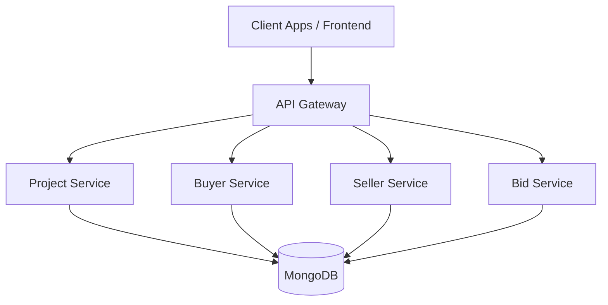
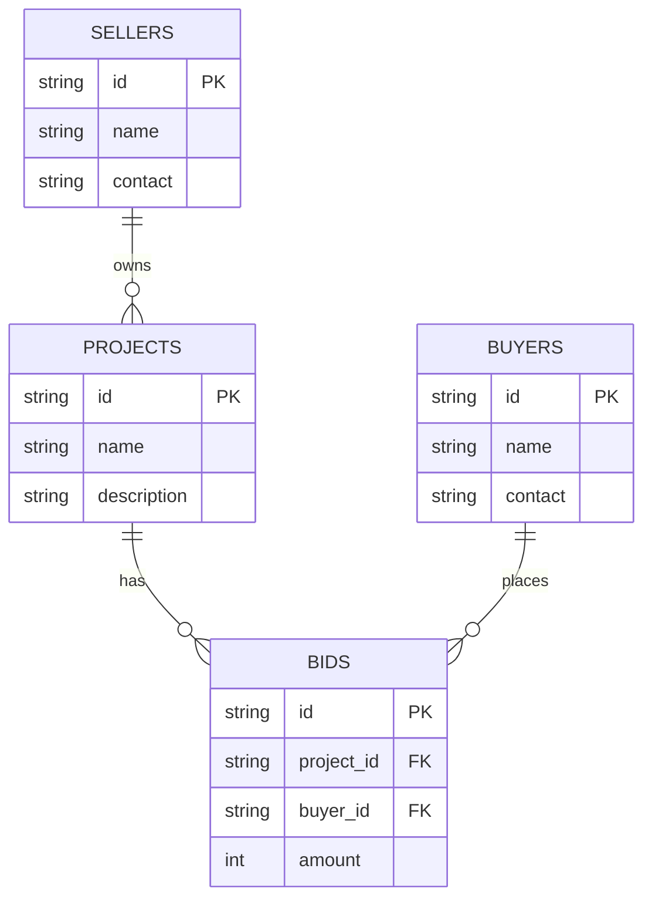

Perfect 👍 Let’s add **visual diagrams** to the README using **Mermaid**.
I’ll include both:

1. **High-level architecture** (microservices + DB)
2. **Database schema relationships** (projects, buyers, sellers, bids)

Here’s the final **README.md** with diagrams added:

---

# Bidding System

**Bidding System** is an online bidding platform where **Sellers** can create projects, and **Buyers** can place bids.
The system manages bids, computes the best bid, and provides APIs to interact with the project, seller, and buyer lifecycle.

---

# 🏗️  Design Patterns Used

The Bidding System applies Factory Pattern to manage the creation of service managers (e.g., ProjectManager, BidManager).

Instead of creating objects directly in controllers, we centralize creation logic. This provides loose coupling, better testability, and easier microservices migration.

# 🔑 Factory Pattern
classDiagram
    class ManagerFactory {
        +NewProjectManager() ProjectManager
        +NewBidManager() BidManager
    }

    class ProjectManager {
        +CreateProject()
        +GetProjects()
        +UpdateProject()
    }

    class BidManager {
        +DoBID()
        +ComputeBID()
    }

    ManagerFactory --> ProjectManager
    ManagerFactory --> BidManager

# Why Factory Pattern?

Encapsulation: Hides the object creation logic.

Flexibility: Easily switch implementations (e.g., swap MongoDB with PostgreSQL).

Testing: Use mock managers in unit tests without changing controller logic.

## 🚀 Features

* Project creation & management
* Buyer & Seller registration
* Bidding on projects
* Automatic bid evaluation (lowest bid wins)
* RESTful APIs for interaction
* MongoDB-backed persistence

---

## 📂 Project Structure

```
bidding-system/
│── config/            # Configuration (DB, app settings)
│── controller/        # API controllers (handlers)
│── resources/
│    ├── project/      # Project, Buyer, Seller models & logic
│    ├── bidManager/   # Core bidding logic
│── util/              # Utilities (MongoDB client, helpers)
│── main.go            # Entry point
```

---

## 🗄️ Database Schema

### Database Configuration

Loaded from `config.toml` into `config.Config`:

```toml
[Database]
Server = "localhost"
Port = "27017"

[DatabaseDetails]
BuyersDBName   = "buyersDB"
SellersDBName  = "sellersDB"
ProjectDBName  = "projectsDB"
CollectionName = "bids"
```

### Collections

#### `projects`

```json
{
  "_id": "p123",
  "Name": "Highway Construction",
  "Description": "Build a 20km highway",
  "BIDS": [
    {
      "BuyerID": "b101",
      "Amount": 50000
    },
    {
      "BuyerID": "b102",
      "Amount": 47000
    }
  ]
}
```

#### `buyers`

```json
{
  "_id": "b101",
  "Name": "ABC Contractors",
  "Contact": "abc@example.com"
}
```

#### `sellers`

```json
{
  "_id": "s201",
  "Name": "Govt. Infrastructure Dept",
  "Contact": "infra@gov.in"
}
```

---

## 📡 API Endpoints

| Method | Endpoint                      | Description                           |
| ------ | ----------------------------- | ------------------------------------- |
| POST   | `/create-project`             | Create a new project (by Seller)      |
| POST   | `/create-buyer`               | Register a new Buyer                  |
| POST   | `/create-seller`              | Register a new Seller                 |
| GET    | `/get-projects`               | Retrieve all available projects       |
| PUT    | `/update-bid?projectID={id}`  | Submit or update a bid for a project  |
| POST   | `/compute-bid?projectID={id}` | Compute the winning bid for a project |

---

## 🖼️ System Architecture



---

## 🗂️ Database Relationships



---

## 🛠️ Deployment

### Local Development

```bash
go run main.go
```

Server runs at `http://localhost:1234`.

### Docker Deployment

```dockerfile
FROM golang:1.22
WORKDIR /app
COPY . .
RUN go build -o bidding-system .
CMD ["./bidding-system"]
```

Build & run:

```bash
docker build -t bidding-system .
docker run -p 1234:1234 bidding-system
```

### Kubernetes (Scaling)

* Define **Deployment** and **Service** YAML.
* Use **Horizontal Pod Autoscaler (HPA)** to scale based on CPU/memory.
* Externalize MongoDB with **StatefulSets** or use **MongoDB Atlas**.

---

## 🧩 Microservices Architecture (Optional)

The app can be decomposed into microservices for better scalability:

* **Project Service** → manages projects
* **Buyer Service** → manages buyers
* **Seller Service** → manages sellers
* **Bid Service** → manages bids and computes winners
* **API Gateway** → routes traffic to the right service

Communication:

* REST or gRPC between services
* Shared MongoDB cluster (or split DBs per service)

---

## 📈 Scaling & Good Practices

* Use **MongoDB Replica Set** for high availability
* Apply **indexes** on `projectID`, `buyerID`
* Use **Redis** cache for hot data (projects, bids)
* Enable **structured logging** with `glog`
* Use **CI/CD pipelines** (GitHub Actions, GitLab CI) for automated builds
* Add **rate limiting & authentication** at API gateway

---

## 👨‍💻 Contributors

* Developed by **AlgoAnalytics Pvt Ltd**
* Maintained by **Keshav and Team**

---

