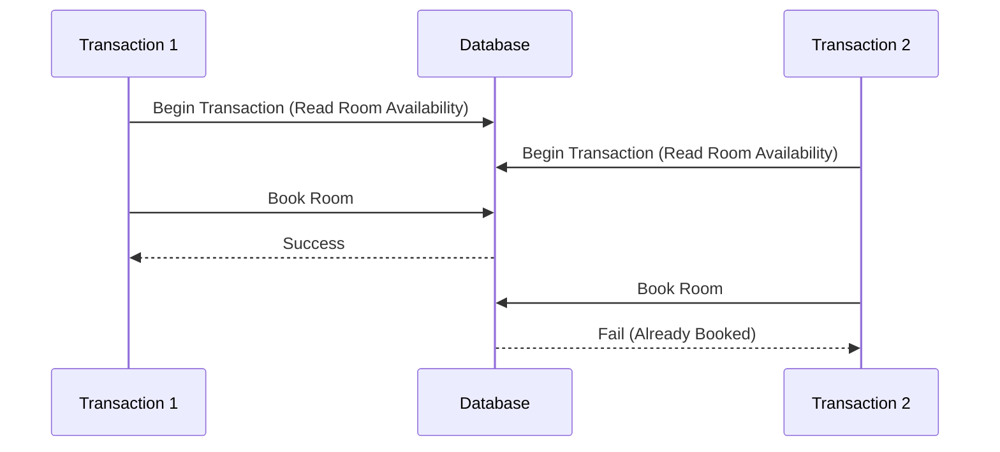
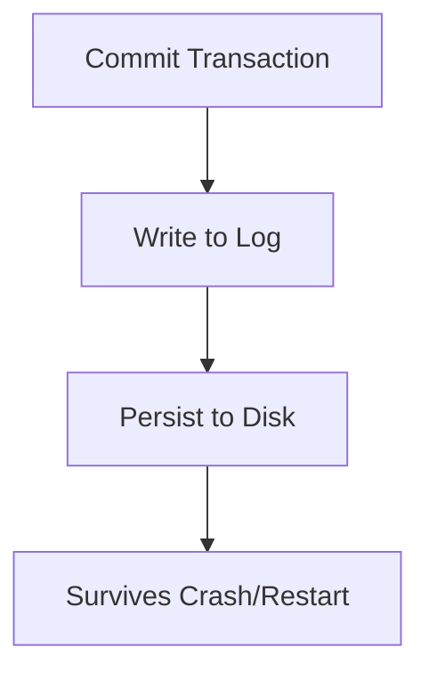
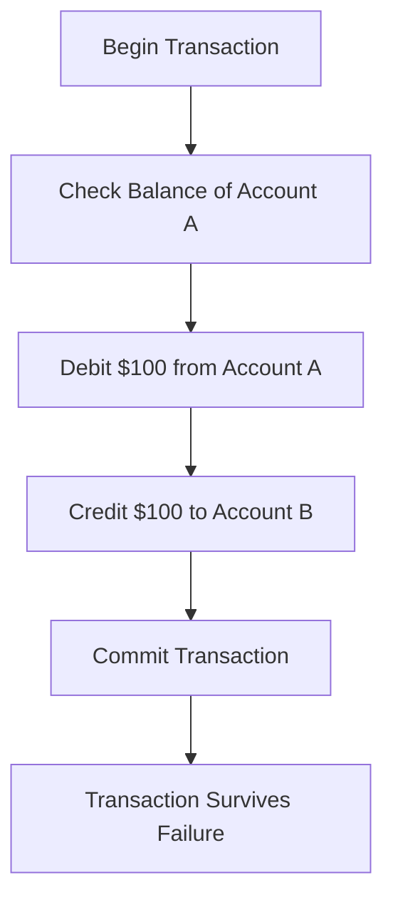

# ACID Properties in Databases

ACID stands for **Atomicity, Consistency, Isolation, Durability**.  
These four properties guarantee **reliable database transactions** in relational systems.  
Without ACID, banking, e-commerce, and mission-critical applications would risk **data corruption** and **inconsistencies**.

---

## 🔹 Atomicity
**Definition:**  
All operations in a transaction are treated as a **single indivisible unit**. Either all succeed, or none do.  

**Real-world example:**  
Money transfer between two accounts: debit from one account **must** be paired with credit to another. If one fails, both are rolled back.

**Implementation:**  
- Transaction logs  
- Rollback mechanisms  
- Two-phase commit protocols  

```mermaid
flowchart TD
    A[Start Transaction] --> B[Debit Account A]
    B --> C{Success?}
    C -- Yes --> D[Credit Account B]
    C -- No --> R[Rollback Transaction]
    D --> E[Commit Transaction]
````

---

## 🔹 Consistency

**Definition:**
Every transaction moves the database from one **valid state** to another, enforcing all rules, constraints, and triggers.

**Real-world example:**

* Bank account cannot go negative if overdrafts are disallowed
* Foreign key constraints prevent orphan records

**Implementation:**

* Referential integrity
* Constraint validation
* Custom business rules

```mermaid
flowchart LR
    A[Valid State] --> B[Apply Transaction]
    B --> C[Check Constraints]
    C -- Passed --> D[New Valid State]
    C -- Failed --> R[Rollback]
```

---

## 🔹 Isolation

**Definition:**
Concurrent transactions act as if they are executed **one at a time**. Prevents dirty reads, phantom reads, and non-repeatable reads.

**Isolation Levels:**

* **Read Uncommitted** (lowest, allows dirty reads)
* **Read Committed**
* **Repeatable Read**
* **Serializable** (highest, fully isolated)

**Real-world example:**
Two customers trying to book the **last hotel room** should not both see it as available.

**Implementation:**

* Locks
* Multiversion Concurrency Control (MVCC)



---

## 🔹 Durability

**Definition:**
Once a transaction is committed, it is **permanently stored**, even in case of system crashes.

**Real-world example:**
After confirming an online order, the purchase remains recorded even if the server crashes immediately.

**Implementation:**

* Write-ahead logging (WAL)
* Backups & recovery mechanisms



---

## 🏦 ACID in Practice: Banking Example

Steps for transferring \$100 from Account A to B:

1. **Atomicity:** Debit A and Credit B occur together
2. **Consistency:** Total money in the system remains unchanged
3. **Isolation:** Other transactions don’t see intermediate states
4. **Durability:** Transaction survives crashes



---

## ✨ Did You Know?

* Modern banks process **over 1 billion ACID-compliant transactions per day** with 99.999% accuracy.
* Without ACID, systems like **ATMs, flight reservations, and e-commerce checkouts** would collapse into chaos.

---

## 📌 Summary

ACID guarantees are the **bedrock of reliable data systems**:

* **Atomicity** → All or nothing
* **Consistency** → Always valid states
* **Isolation** → Transactions don’t interfere
* **Durability** → Changes survive failures

Together, they ensure **data integrity, correctness, and trustworthiness** in any relational database system.

```

---

👉 Do you also want me to create a **PowerPoint (PPTX)** version of this ACID explanation with the diagrams embedded, like the earlier one I made for databases?
```
