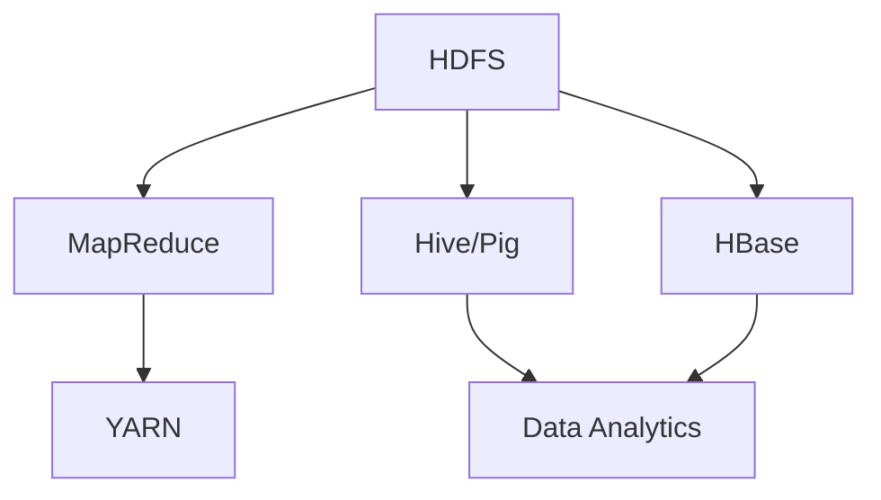
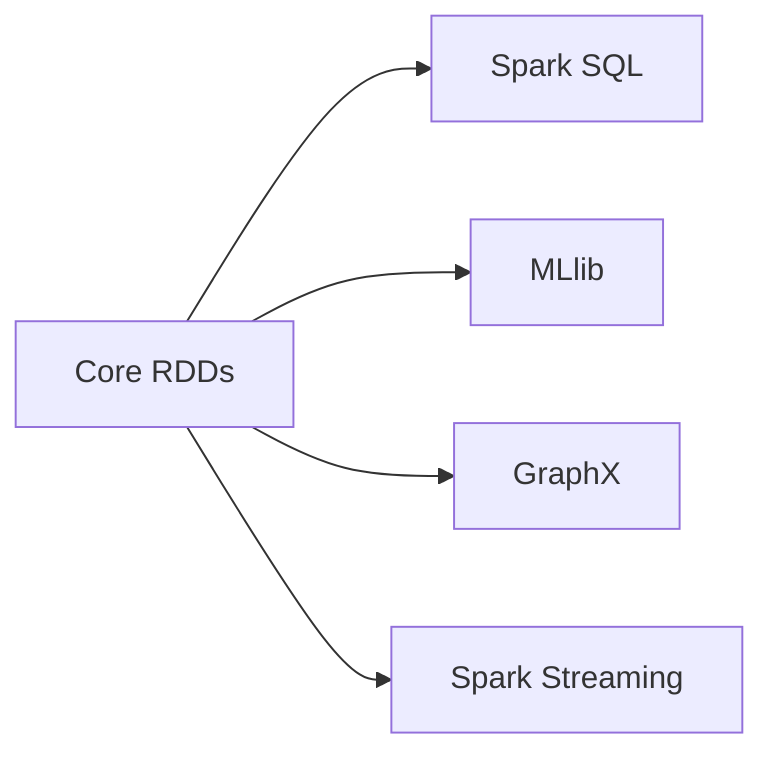
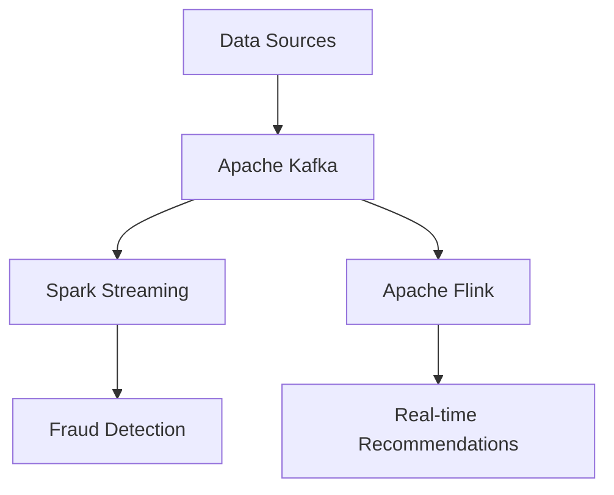

Here’s a **deeply detailed `README.md`** for **Big Data Technologies: Hadoop, Spark & Beyond**, with diagrams, case studies, SQL/PySpark snippets, and “Did you know?” sections 👇

---

# 🌐 Big Data Technologies: Hadoop, Spark & Beyond

> **Performance Leap:**
> Apache Spark can process data **100x faster** than traditional Hadoop MapReduce by keeping data **in memory** between operations.

The **Big Data revolution** transformed how organizations process **massive datasets** that traditional databases couldn’t handle effectively.
This ecosystem enables **petabyte-scale analytics** across clusters of **commodity hardware**, powering **business intelligence, fraud detection, IoT, and AI model training**.

---

## 🏗️ Apache Hadoop Ecosystem



* **HDFS** → Distributed storage with replication & fault tolerance
* **MapReduce** → Batch-oriented parallel processing
* **YARN** → Resource manager & job scheduler

✅ **Use Cases** → Batch ETL, log analysis, archiving
✅ **Strengths** → Proven at scale, cost-effective storage

🧠 **Did you know?**
Yahoo! was the first company to run **Hadoop clusters at web scale** in the 2000s.

---

## ⚡ Apache Spark



* **In-Memory Processing** → Faster than MapReduce
* **RDDs (Resilient Distributed Datasets)** → Core data structure
* **Ecosystem** → SQL, MLlib, GraphX, Streaming
* **Languages** → Scala, Java, Python, R

✅ **Use Cases** → Real-time analytics, ML training, interactive queries
✅ **Performance** → 100x faster for iterative workloads

🧠 **Did you know?**
Spark was originally built at **UC Berkeley’s AMPLab** before moving to the **Apache Foundation**.

---

## 🐍 PySpark Integration

* **Python API** → Easy for data scientists
* **DataFrames** → Pandas-like API
* **ML Integration** → Works with Scikit-learn, TensorFlow, PyTorch
* **Jupyter Support** → Interactive prototyping

🔎 **Example: Real-time log analysis**

```python
from pyspark.sql import SparkSession
from pyspark.sql.functions import window, count, avg

spark = SparkSession.builder.appName("RealTimeAnalytics").getOrCreate()

# Stream data from Kafka
stream_df = spark.readStream.format("kafka") \
    .option("kafka.bootstrap.servers", "localhost:9092").load()

# Windowed analysis
analysis = stream_df.selectExpr("CAST(timestamp AS TIMESTAMP)", "user_id", "action") \
    .groupBy(window("timestamp", "10 minutes"), "action") \
    .agg(count("user_id").alias("user_count"))

query = analysis.writeStream.outputMode("update").format("console").start()
query.awaitTermination()
```

---

## 🔄 Stream Processing



* **Tech** → Kafka, Flink, Storm, Spark Streaming
* **Latency** → Sub-second
* **Use Cases** → Fraud detection, IoT, real-time recs

🧠 **Did you know?**
Credit card networks use streaming to detect fraud in **<200ms**.

---

## 🏛️ Big Data Architecture Patterns

### Lambda

* Batch + Streaming layers
* Accuracy + Low Latency
* Example: Twitter timelines

### Kappa

* Streaming-only architecture
* Simpler, uses infinite windows
* Example: IoT pipelines

### Data Lake

* Stores **raw data** (schema-on-read)
* Bronze → Silver → Gold layers

```mermaid
graph TD
    A[Raw Data (Bronze)] --> B[Cleaned Data (Silver)]
    B --> C[Business-Ready Data (Gold)]
```

---

## 🏢 Case Study: Netflix Data Platform

* **Data Lake** → AWS S3
* **Streaming** → Kafka for events
* **Batch** → Spark for historical analysis
* **ML** → Personalized recommendations
* **Scale** → 1 Trillion+ events daily

🧠 **Scale Insight**:
Netflix processes enough daily data to fill **150,000 DVD-quality movies**!

---

## 🏗️ Data Engineering & Modern Data Platforms

### 🔹 Ingestion

* **Batch** → Airflow, NiFi
* **Streaming** → Kafka, Kinesis
* **CDC** → Fivetran, Debezium

### 🔹 Storage

* **Data Lakes** → S3, GCS, Delta Lake
* **Formats** → Parquet, ORC, Avro

### 🔹 Processing

* **Batch** → Spark, dbt
* **Streaming** → Flink, Kafka Streams

### 🔹 Access

* **Engines** → Presto, Athena, Drill
* **Viz** → Tableau, Looker, Superset

---

## 🏰 Data Lake vs Data Warehouse

| Feature    | Data Lake                       | Data Warehouse              |
| ---------- | ------------------------------- | --------------------------- |
| Schema     | Schema-on-read                  | Schema-on-write             |
| Data Types | All (structured + unstructured) | Structured only             |
| Cost       | Cheap raw storage               | Expensive compute optimized |
| Use Cases  | ML, AI, IoT                     | BI, dashboards              |
| Users      | Data scientists                 | Analysts, execs             |

🧠 **Did you know?**
**Databricks** coined the term **“Lakehouse”**, combining the flexibility of lakes with the structure of warehouses.

---

## 🌍 Amazing Database Innovations

* **AWS Aurora** → MySQL/Postgres compatible, 5x throughput
* **Google Spanner** → Global, consistent, distributed SQL
* **Apache Cassandra** → Peer-to-peer NoSQL at Meta scale
* **MongoDB** → JSON docs, developer-friendly

---

# 🚀 Conclusion

Big Data systems have evolved from **batch-oriented Hadoop** to **real-time, cloud-native, AI-ready platforms**.
The future is in **Lakehouses, streaming-first designs, and AI-powered query engines**.

---

