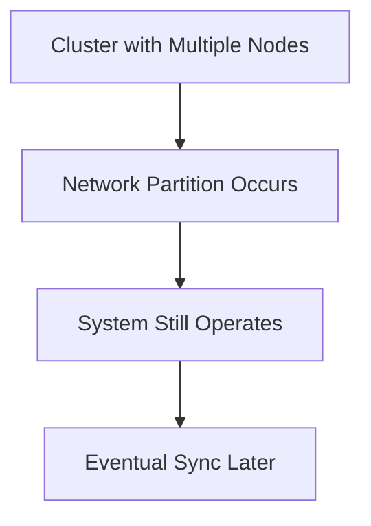
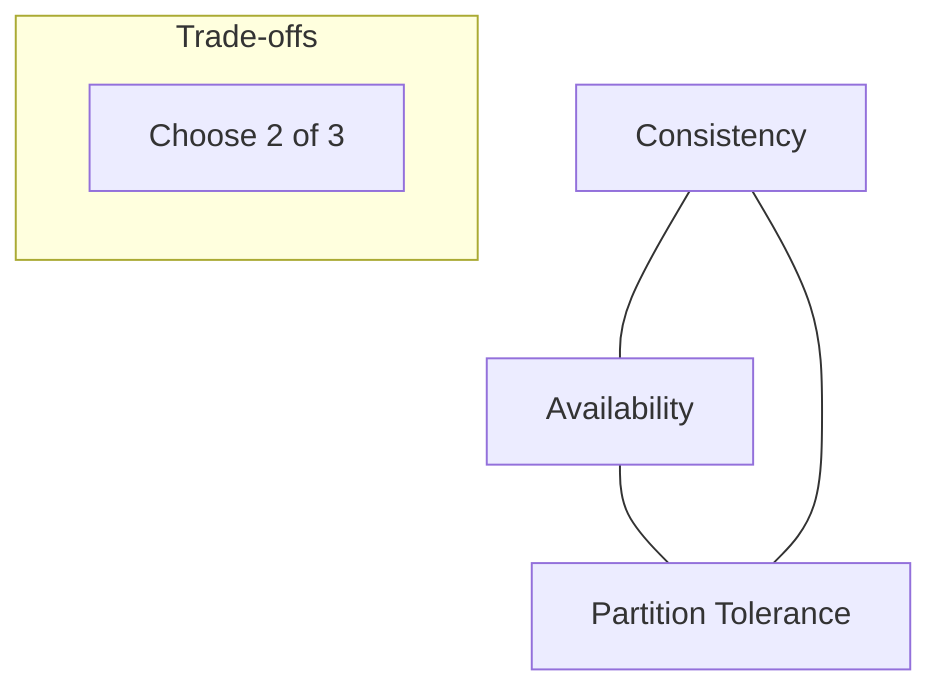

Here’s a **structured `README.md` with diagrams** for the **CAP Theorem**, following the same style as your ACID one:

````markdown
# CAP Theorem in Distributed Systems

The **CAP theorem**, formulated by **Eric Brewer** (2000) and formally proven by **Seth Gilbert & Nancy Lynch** (2002), states that in a **distributed system**, it is **impossible** to guarantee all three of the following at the same time:  

- **C**onsistency  
- **A**vailability  
- **P**artition Tolerance  

Instead, systems can only guarantee **two out of three**.

---

## 🔹 The Three Properties

### 1. Consistency (C)
All nodes in the system see the **same data at the same time**.  
Every read receives the **latest write** or an error.

✅ Example: In a distributed cache, when a user updates their profile, all servers must show the updated data immediately.  

```mermaid
flowchart TD
    A[Write Data on Node 1] --> B[Replicate to Node 2]
    B --> C[Client Reads]
    C --> D[Always Sees Latest Data]
````

---

### 2. Availability (A)

The system is **always responsive**, even if some nodes fail.
Every request receives a (possibly stale) response.

✅ Example: A social media app continues to serve posts, even if some servers are down.

```mermaid
flowchart TD
    A[Client Request] --> B[Available Node Responds]
    B --> C[Response Sent]
    C --> D[May not be Latest Data]
```

---

### 3. Partition Tolerance (P)

The system continues to function despite **network failures** that prevent nodes from communicating.

✅ Example: A global database continues operating even if network issues block communication between data centers.



---

## 🔹 CAP Trade-offs

Since **network partitions are inevitable** in distributed systems, designers must choose between **Consistency (C)** and **Availability (A)** when partitions occur.

### 1. CP Systems (Consistency + Partition Tolerance)

* Prioritize **strong consistency**
* May sacrifice availability during partitions
* ✅ Examples:

  * **MongoDB** (with majority writes)
  * **HBase**
  * **Etcd**
  * **Consul**

Use Cases: **Banking, configuration management, coordination services**

---

### 2. AP Systems (Availability + Partition Tolerance)

* Remain **highly available** during partitions
* Allow **eventual consistency** (data may temporarily be stale)
* ✅ Examples:

  * **Cassandra**
  * **DynamoDB**
  * **Riak**
  * **CouchDB**

Use Cases: **Social media, shopping carts, IoT, content delivery**

---

### 3. CA Systems (Consistency + Availability)

* Theoretical in distributed systems, since **partitions always happen**
* ✅ Examples (non-distributed / single-node):

  * **Traditional RDBMS** (PostgreSQL, MySQL standalone)
  * **LDAP**
  * **Cluster DBs with shared storage**

Reality: **True CA doesn’t exist in large distributed systems**

---

## 🔹 Netflix’s CAP Strategy (AP Example)

Netflix prioritizes **Availability + Partition Tolerance**:

* Uses **Cassandra** for user data (eventual consistency)
* Each region operates independently during network issues
* Graceful degradation: recommendations may be slightly stale
* Conflict resolution via **last-writer-wins** and application logic

✅ Business impact: Users can **keep streaming videos** even if some data centers cannot sync immediately.

---

## 🔹 CAP Theorem Visualization



---

## ✨ Did You Know?

* **Amazon** reported that **100ms of extra latency costs 1% in sales**. This is why many large-scale web apps **prefer AP systems** (Availability first).
* **Facebook’s Cassandra** handles **1 trillion requests daily**, favoring **AP trade-offs** for global availability.

---

## 📌 Summary

* **CAP Theorem** proves you cannot have **all three** guarantees in a distributed system.
* **CP Systems:** Strong consistency, lower availability → good for financial systems.
* **AP Systems:** High availability, eventual consistency → good for social media, e-commerce.
* **CA Systems:** Only possible in non-distributed setups.

👉 In practice: **Most real-world distributed systems are AP**, because downtime hurts more than stale data.


```
