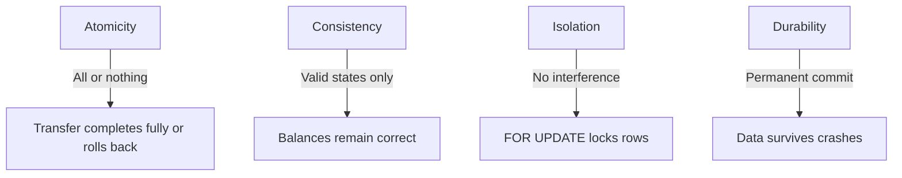
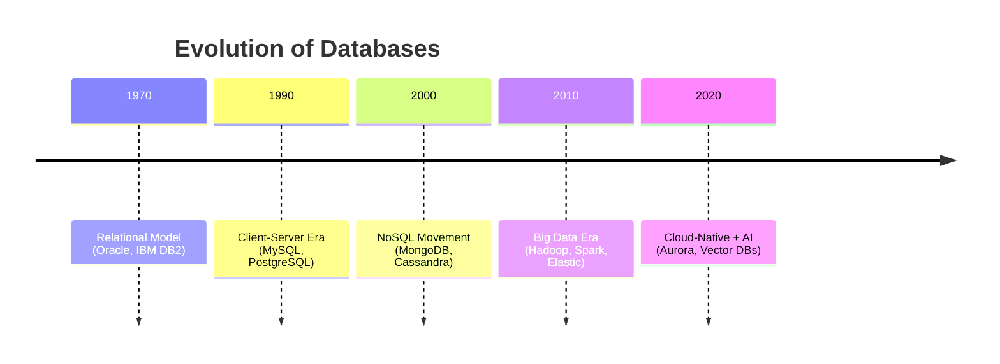

# ⚡ Database Transactions & ACID Properties

## 📌 Why Transactions Are Hard

Database **transactions** guarantee **data integrity** in multi-step operations (like banking transfers).
They follow **ACID** properties: **Atomicity, Consistency, Isolation, Durability**.

🧠 **Did you know?**
The term **ACID** was coined in **1983** by **Theo Härder & Andreas Reuter**, and it’s still the **bedrock of reliable database systems** today.

---

## 🏦 Illustrative Example: Bank Transfer

```sql
START TRANSACTION;

-- Step 1: Check sender’s balance
SELECT balance
FROM accounts
WHERE account_id = 101
FOR UPDATE; -- lock row to prevent race conditions

-- Step 2: Deduct from sender
UPDATE accounts
SET balance = balance - 5000
WHERE account_id = 101
  AND balance >= 5000;

-- Step 3: Credit receiver
UPDATE accounts
SET balance = balance + 5000
WHERE account_id = 202;

-- Step 4: Log transaction
INSERT INTO transactions (from_account, to_account, amount, txn_date, status)
VALUES (101, 202, 5000, NOW(), 'SUCCESS');

-- Step 5: Commit changes
COMMIT;

-- If error → undo everything
ROLLBACK;
```

💡 **Why critical?**
If crash occurs after deduction but before credit → **money disappears!**
ACID ensures **all-or-nothing**.

---

## 🔑 ACID Properties



* **Atomicity** → Entire transaction is one unit (bank transfer = debit + credit).
* **Consistency** → Always valid (total money before = total money after).
* **Isolation** → Prevents race conditions (row locking, isolation levels).
* **Durability** → Once committed → survives crash, reboot, or power loss.

---

## ⚠️ Why This is Hard

* **Concurrency** → Multiple users updating same account → need row locks.
* **Rollback Handling** → Undo half-done transactions cleanly.
* **Isolation Levels** → Balance between performance & safety:

  * `READ COMMITTED`
  * `REPEATABLE READ`
  * `SERIALIZABLE`

🧠 **Did you know?**
Global payment networks like **Visa** process **65,000+ transactions per second**. Guaranteeing **ACID at this scale is an engineering marvel**.

---

## 🛠️ Advanced SQL Concepts

### 1. Sophisticated Sorting

```sql
SELECT product_name, sales_amount
FROM products
ORDER BY 
  CASE WHEN category = 'Electronics' THEN 1 ELSE 2 END,
  sales_amount DESC;
```

### 2. Aggregations with ROLLUP

```sql
SELECT region, product_category, SUM(sales_amount) AS total_sales
FROM sales
GROUP BY ROLLUP(region, product_category);
```

### 3. Recursive CTE (Employee Hierarchy)

```sql
WITH RECURSIVE hierarchy AS (
  SELECT employee_id, name, manager_id, 1 AS level
  FROM employees WHERE manager_id IS NULL
  UNION ALL
  SELECT e.employee_id, e.name, e.manager_id, h.level+1
  FROM employees e JOIN hierarchy h ON e.manager_id = h.employee_id
)
SELECT * FROM hierarchy ORDER BY level, name;
```

🧠 **Did you know?**
**Recursive CTEs** (SQL:1999) let you query **graph-like data** without leaving SQL.

---

## 🚨 Deadlocks & Isolation Levels

```sql
SET TRANSACTION ISOLATION LEVEL SERIALIZABLE;
```

* **Deadlock scenario**:

  * Transaction 1 → updates Account A then B
  * Transaction 2 → updates Account B then A
    → Both **wait forever** 🌀

💡 DBMS detects deadlocks → rolls back one transaction.

---

## 📊 Materialized Views & Performance

```sql
CREATE MATERIALIZED VIEW monthly_sales_summary AS
SELECT DATE_TRUNC('month', order_date) AS sales_month,
       product_id,
       SUM(quantity * price) AS total_revenue
FROM orders
GROUP BY 1, 2;
```

* Pre-computed results
* Boosts reporting performance
* Must be **refreshed** periodically

---

## 🏗️ Partitioning vs Sharding

```sql
CREATE TABLE sales_by_year (
    sale_id INT,
    sale_date DATE,
    amount DECIMAL(10,2)
) PARTITION BY RANGE (EXTRACT(YEAR FROM sale_date)) (
    PARTITION p2022 VALUES LESS THAN (2023),
    PARTITION p2023 VALUES LESS THAN (2024),
    PARTITION p_future VALUES LESS THAN (MAXVALUE)
);
```

* **Partitioning** = splitting inside one DB
* **Sharding** = splitting across multiple DBs

---

## 🕰️ Evolution of Database Tech



---

## 🔮 Choosing the Right Tech

| Tech           | Strengths                        | Use Cases                   |
| -------------- | -------------------------------- | --------------------------- |
| MySQL/Postgres | Strong ACID, structured data     | Banking, eCommerce          |
| MongoDB        | Flexible schema, JSON docs       | IoT, CMS, mobile apps       |
| Cassandra      | Scale + availability             | IoT, time-series, messaging |
| Aurora         | Cloud-native, fast, auto-scaling | SaaS, analytics             |

---

## ⚡ Real-World Insights

* **Netflix** → Master-slave replication for **global scale**.
* **Visa** → ACID at **65k TPS**.
* **Amazon** → Latency >100ms → **1% drop in sales**.

---

