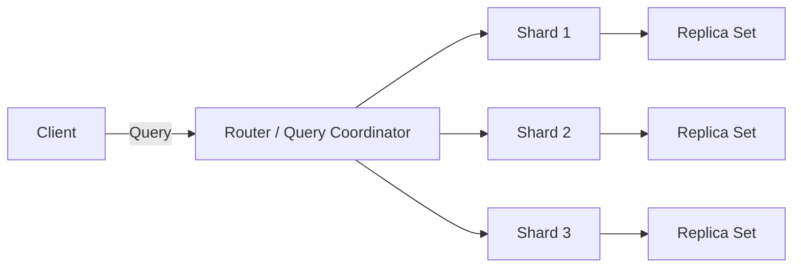

# 🗄️ Non-Relational Databases (NoSQL)

---

## 📖 What are Non-Relational Databases?

Non-relational databases, often referred to as **NoSQL databases**, represent a **shift from the traditional relational model**.  

- Instead of predefined tables with strict schemas, NoSQL databases store data in **flexible formats**.  
- They are optimized for **scalability, high availability, and specific access patterns**.  
- Widely used in modern applications dealing with **massive volumes of unstructured or semi-structured data**.  

📌 **Use cases**:  
- Real-time web apps ⚡  
- Big Data analytics 📊  
- Content management systems 📝  
- Mobile backends 📱  

---

## ✅ Key Characteristics & Benefits

- **Flexible Schemas** → Store diverse and evolving data without predefined structures.  
- **High Scalability** → Horizontal scaling across multiple servers.  
- **High Availability** → Built-in replication & fault tolerance.  
- **Performance** → Optimized for real-time queries on huge datasets.  

---

## 🔹 Types of NoSQL Databases

### 📄 Document Stores
- Store data as JSON / BSON / XML documents.  
- **Examples**: MongoDB, CouchDB  
- **Use Cases**: Content management, product catalogs, user profiles  

### 🔑 Key-Value Stores
- Simple `key → value` lookup for blazing-fast access.  
- **Examples**: Redis, DynamoDB  
- **Use Cases**: Caching, session storage, shopping carts  

### 📊 Column-Family Stores
- Store data in column families instead of rows.  
- **Examples**: Cassandra, HBase  
- **Use Cases**: Time-series data, IoT applications  

### 🔗 Graph Databases
- Focus on relationships between entities.  
- **Examples**: Neo4j, Amazon Neptune  
- **Use Cases**: Social networks, recommendation engines  

---

## 📊 NoSQL Database Landscape Diagram

```mermaid
mindmap
  root((NoSQL Databases))
    Document Stores
      MongoDB
      CouchDB
    Key-Value Stores
      Redis
      DynamoDB
    Column-Family Stores
      Cassandra
      HBase
    Graph Databases
      Neo4j
      Amazon Neptune
````

---

## ⚙️ Example: MongoDB Document Structure

Instead of relational rows, data is stored as **documents**:

```json
{
  "UserID": 1,
  "Name": "Alice Doe",
  "Orders": [
    { "OrderID": 5001, "Product": "Laptop", "Quantity": 1 },
    { "OrderID": 5002, "Product": "Phone", "Quantity": 2 }
  ]
}
```

👉 This removes the need for complex joins and makes retrieval **faster and schema-flexible**.

---

## 🌍 Sharding & Replication in NoSQL

Most NoSQL databases achieve **scalability and availability** with sharding and replication.



* **Sharding**: Data is split across multiple servers.
* **Replication**: Each shard has replicas for fault tolerance.

---

## 💡 Did You Know?

* Facebook’s **Cassandra** handles **1+ trillion requests/day**.
* MongoDB powers apps like **eBay and Adobe**, managing **billions of documents**.
* Amazon’s DynamoDB can scale to **millions of requests per second**.

---

```


```
