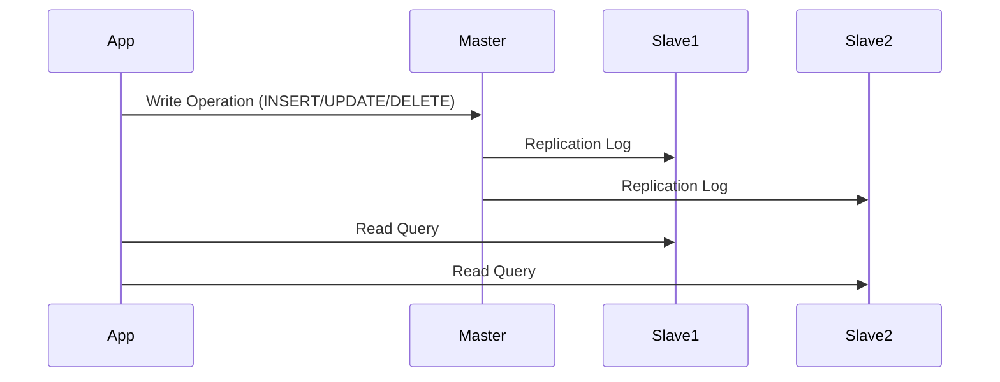

# Database Sharding & Replication

## 📌 Scale Achievement
Instagram uses **sharding** to manage **billions of photos** across thousands of database nodes, enabling **sub-second query response times globally**.

---

## 🔹 What is Database Sharding?

Database sharding is a **horizontal partitioning technique** that splits large databases into smaller, more manageable pieces called **shards**.  
Each shard is a separate database holding a subset of the data, distributed across multiple servers or data centers.

✅ **Advantages**:  
- Handles scalability limitations of monolithic DBs  
- Distributes both **data storage** and **query processing**  
- Enables **linear scalability** by adding servers (horizontal scaling)  

---

## 🏛 Monolithic vs Sharded Database

```mermaid
flowchart TD
    A[Monolithic Database] -->|All operations in one DB| B[Performance Bottlenecks]
    C[Sharded Database] -->|Data split across shards| D[Parallel Processing + High Performance]
    E[Linear Scalability] -->|Add more shards| D
````

---

## ⚡ Sharding Strategies

### 🔹 Range-Based Sharding

* Data partitioned by ranges (e.g., User IDs 1–1000 → Shard A, 1001–2000 → Shard B)
* ✅ Simple, efficient range queries
* ❌ Hot spots if uneven data distribution

### 🔹 Hash-Based Sharding

* Records assigned to shards using `hash(key) % shard_count`
* ✅ Even distribution
* ❌ Range queries span multiple shards

### 🔹 Directory-Based Sharding

* A lookup service maps keys → shards
* ✅ Flexible & custom logic
* ❌ Extra complexity, possible single point of failure

### 🔹 Geographic Sharding

* Data partitioned by **location/region**
* ✅ Low latency, compliance with residency laws
* ❌ Uneven load, complex cross-region queries

---

## 🚨 Implementation Challenges

* **Cross-shard queries** → Denormalization, caching, distributed query engines
* **Rebalancing** → Consistent hashing, automated balancing (MongoDB)
* **Transaction consistency** → Two-phase commit, Saga pattern, eventual consistency

---

## 🏗 Sharding Architecture Patterns

```mermaid
flowchart LR
    A[Monolithic Database] -->|Limitations| B[CPU, Memory, Storage Bottlenecks]
    A -->|Scaling| C[Vertical Only - Expensive Hardware]
    A -->|Availability| D[Single Point of Failure]

    E[Sharded Architecture] -->|Data Distribution| F[Independent DB Instances]
    F -->|Benefits| G[Parallel Processing + Load Balancing]
    F -->|Challenges| H[Cross-shard Queries + Rebalancing]
    E -->|Scaling| I[Linear Scaling with More Shards]
```

---

## 🔎 Sharding in Practice

* Instagram shards **user data by UserID** using **consistent hashing**
* Media content uses **geographic sharding**
* Handles **95M posts/day** and **500M+ DAUs** with **<1s latency**

---

## 🗂 Master-Slave Replication

Master-slave replication improves **performance & reliability** by maintaining multiple copies of data.

* **Master** → Handles **all writes (INSERT, UPDATE, DELETE)**
* **Slaves** → Replicate master data, handle **reads**

---

## 🔄 Replication Process



---

## ⚙️ Types of Replication

* **Asynchronous** → High performance, risk of data loss on failure
* **Semi-synchronous** → Balance between speed & consistency
* **Synchronous** → Strong consistency, higher latency
* **Geographic** → Slaves across regions for **disaster recovery & latency reduction**

---

## ✅ Example: MySQL Master-Slave Setup

### Master `my.cnf`

```ini
[mysqld]
server-id = 1
log_bin = /var/log/mysql/mysql-bin.log
binlog_do_db = your_database_name
```

### Slave `my.cnf`

```ini
[mysqld]
server-id = 2
read_only = 1
relay_log = /var/log/mysql/mysql-relay-bin.log
```

### SQL on Master

```sql
CREATE USER 'repl_user'@'%' IDENTIFIED BY 'your_secure_password';
GRANT REPLICATION SLAVE ON *.* TO 'repl_user'@'%';
FLUSH PRIVILEGES;
SHOW MASTER STATUS;
```

### SQL on Slave

```sql
STOP SLAVE;
CHANGE MASTER TO
    MASTER_HOST='master_ip',
    MASTER_USER='repl_user',
    MASTER_PASSWORD='your_secure_password',
    MASTER_LOG_FILE='mysql-bin.000001',
    MASTER_LOG_POS=123;
START SLAVE;
SHOW SLAVE STATUS\G;
```

---

## 🌍 Real-World Use Case

* **Netflix** → Uses **dozens of read replicas globally**
* Ensures **sub-100ms response times** for 200M+ subscribers

---

## 📘 Did You Know?

* **Google Spanner** → A globally distributed database combining **sharding** + **synchronous replication**
* Provides **SQL + strong consistency** across **continents**

---

```

---

👉 Would you like me to also **add an advanced SQL section (joins, groupby, orderby with diagrams)** into this same `README.md`, or keep sharding + replication only?
```
