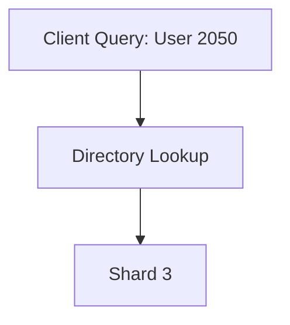
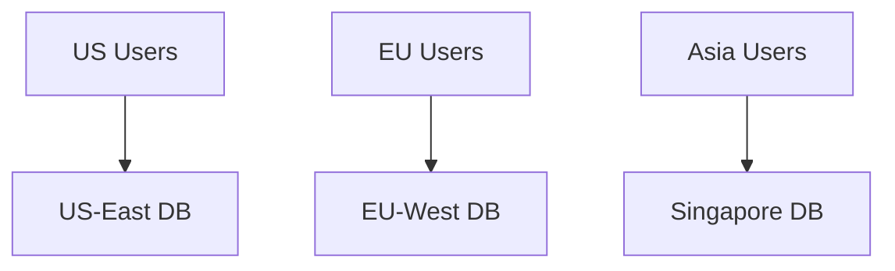
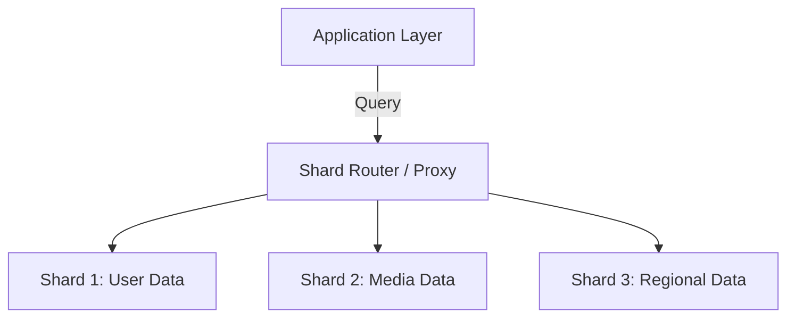

# 🗂️ Database Sharding

Sharding is a **horizontal partitioning technique** that splits large databases into **smaller, independent pieces (shards)**.  
Each shard contains a **subset of the total data** and operates as a separate database, usually distributed across servers or regions.  

This allows applications to **scale linearly**, avoiding the bottlenecks of a single large (monolithic) database.

---

## ⚡ Why Sharding?

- 🚀 **Performance** → Queries run faster since each shard stores less data  
- 🌍 **Scalability** → Add new shards to handle growing workloads  
- 🔄 **Parallelism** → Multiple shards handle queries concurrently  
- 🛡️ **Fault Isolation** → Failures in one shard don’t impact others  

📌 **Scale Example:** Instagram uses sharding to manage **billions of photos** across thousands of database nodes, achieving **sub-second query responses globally**.

---

## 🏗️ Monolithic vs Sharded Database

```mermaid
flowchart LR
    A[Monolithic DB] -->|Single Point| B[(All Data in One Place)]
    C[Sharded DB] -->|Split into Parts| D[(Shard 1: User IDs 1-1000)]
    C --> E[(Shard 2: User IDs 1001-2000)]
    C --> F[(Shard 3: User IDs 2001-3000)]
````

* **Monolithic DB** → Centralized, but becomes a **bottleneck** at scale
* **Sharded DB** → **Distributed load**, scales horizontally

---

## 🧭 Sharding Strategies

### 🔹 Range-Based Sharding

* Partition by value ranges (e.g., `UserID 1-1000 → Shard A`)
  ✅ Pros: Easy to implement, range queries efficient
  ❌ Cons: Risk of **hot spots** if data is uneven

```mermaid
flowchart TD
    A[User IDs] --> B[1-1000 → Shard A]
    A --> C[1001-2000 → Shard B]
    A --> D[2001-3000 → Shard C]
```

---

### 🔹 Hash-Based Sharding

* Use a hash function (`hash(key) % shard_count`)
  ✅ Pros: Even distribution, avoids hot spots
  ❌ Cons: Range queries must scan multiple shards

```mermaid
flowchart TD
    A[UserID 1234] --> B[Hash(UserID) % 3 = 1] --> C[Shard B]
```

---

### 🔹 Directory-Based Sharding

* Lookup table maps keys → shards
  ✅ Pros: Flexible, supports custom logic
  ❌ Cons: Directory can be a bottleneck



---

### 🔹 Geographic Sharding

* Partition data by **region**
  ✅ Pros: Lower latency, meets compliance (GDPR, residency laws)
  ❌ Cons: Cross-region queries complex



---

## ⚙️ Challenges & Solutions

### 🔄 Cross-Shard Queries

* Challenge: Joins/aggregates across shards
* Solutions:

  * Denormalization
  * Application-level joins + caching
  * Distributed query engines (Presto, Apache Drill)

### 🔒 Transaction Consistency

* Challenge: ACID across shards
* Solutions:

  * Two-phase commit (2PC)
  * Saga pattern (eventual consistency)
  * Event sourcing

### ⚖️ Rebalancing

* Challenge: Uneven shard growth
* Solutions:

  * Consistent hashing
  * Automated migration (MongoDB balancer)
  * Shadow writes during cutover

---

## 📐 Sharding Architecture



* **Shard Router** directs queries to correct shard
* **Each shard = independent database**
* **Load balanced** across infrastructure

---

## 🌟 Real-World Example: Instagram

* **User Data:** Sharded by UserID (consistent hashing)
* **Media Content:** Sharded by **geographic region**
* **Scale:**

  * 2B+ photos
  * 95M posts daily
  * 500M+ daily active users
  * Sub-second query response globally

---

## 💡 Did You Know?

* **MongoDB** and **Cassandra** have built-in sharding support
* **Google Spanner** achieves global scale using sharding + **TrueTime API** for consistency
* **Amazon Aurora** supports sharding with partitioned storage and replicas

---


