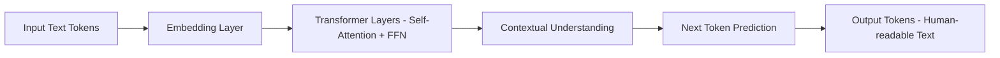
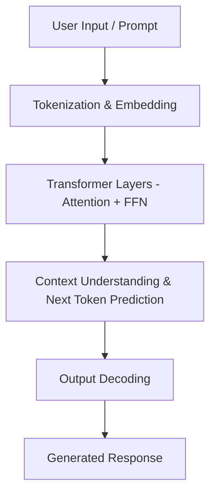
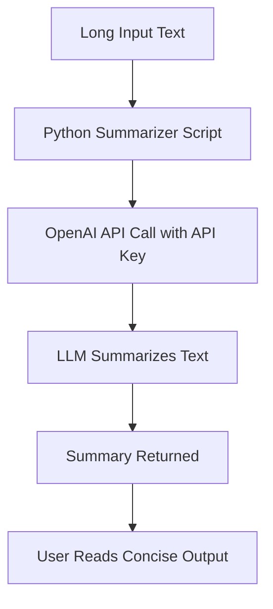
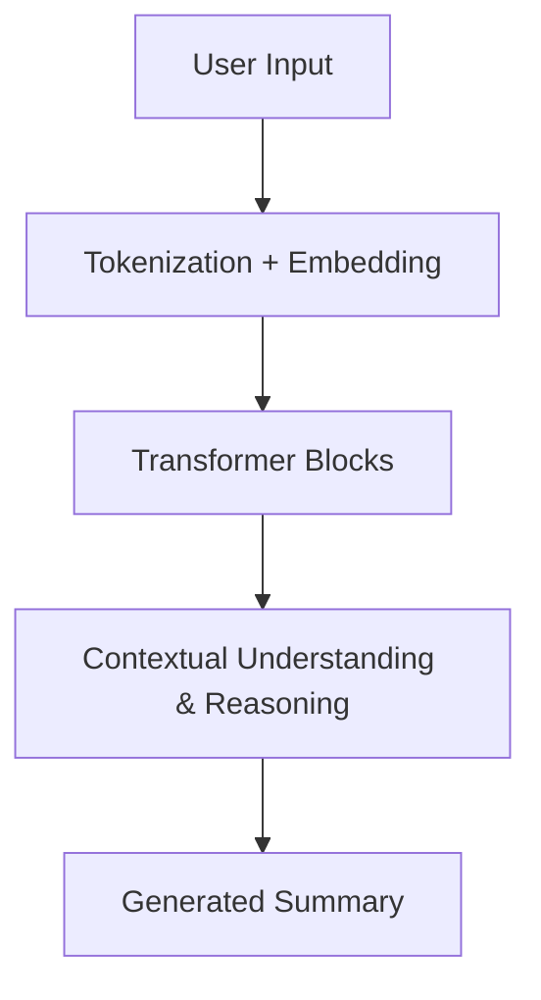
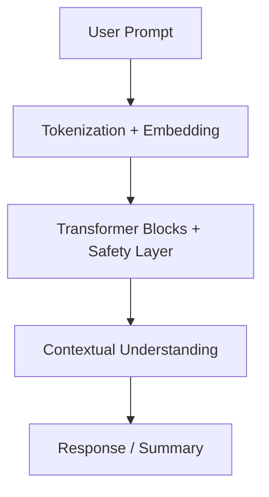
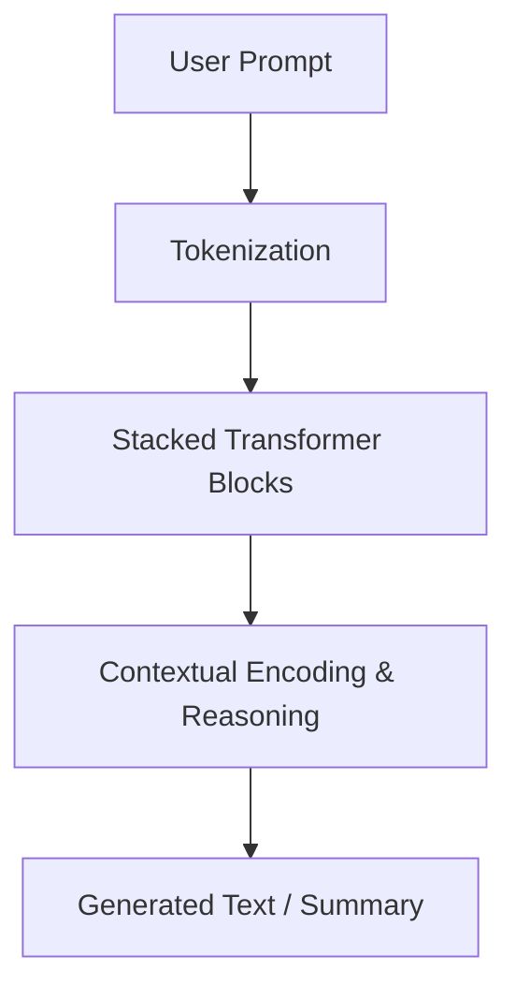
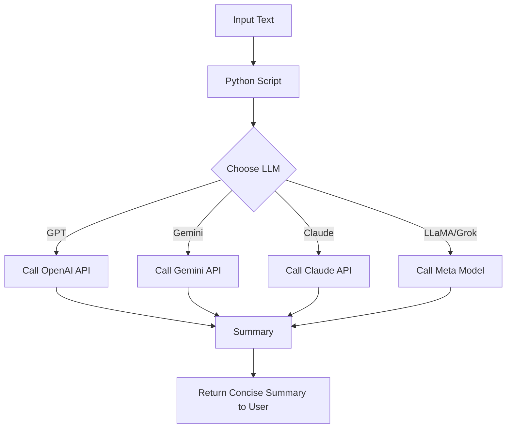
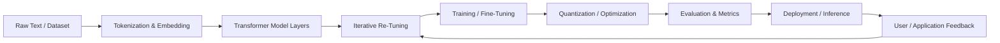
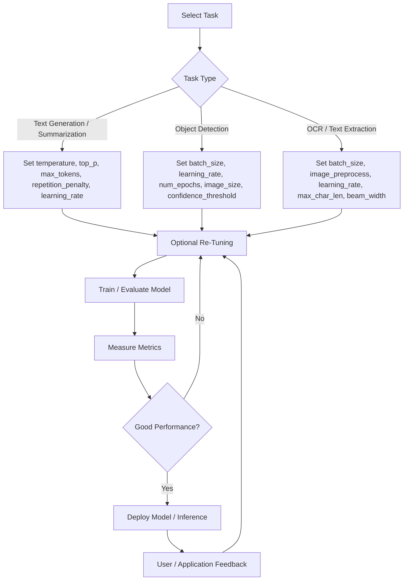

# 📖 Day 78+: Generative AI – LLMs, Vector DBs, Quantization & Summarization

## 🚀 Introduction

The explosion of text data in research papers, reports, news, and conversations has made **information processing overwhelming**.
**Large Language Models (LLMs)** help by understanding, summarizing, and generating human-like text.

Beyond OpenAI GPT models, other major LLMs include:

* **Gemini (Google DeepMind)** – advanced reasoning & summarization
* **Claude (Anthropic)** – safe conversational AI
* **Meta LLaMA / Grok** – open-weight models for research & enterprise AI

This guide covers:

1. Python usage examples
2. LLM architectures
3. Tokenization process
4. End-to-end summarization workflow
5. Vector databases for retrieval
6. Quantization for efficient inference
7. Advanced engineering tips for billion-parameter models
8. References and recommended papers

---

## 🔍 What is an LLM?

A **Large Language Model** is a deep neural network trained on massive text data to **understand and generate human-like language**.

**Capabilities**:

* Summarization
* Question answering
* Code generation
* Conversational AI

**Examples:** GPT-4, GPT-5, Gemini, Claude, LLaMA/Grok


**Key Points**:

* Training data: books, websites, code, conversations

* Capabilities: summarization, translation, question-answering, coding

* Examples: GPT-4, GPT-5, Gemini, Claude, LLaMA/Grok

* Why LLMs matter:

* Automates time-consuming reading and summarization

* Can simplify technical language for accessibility

* Works across domains like health, law, research, and education


---

## 🔹 What is Tokenization?

**Tokenization** is the process of **breaking text into smaller units (tokens)** that a model can process:

* Words, subwords, or characters are converted to **numeric IDs**
* These IDs are then embedded into **vectors** for the model
* Enables LLMs to process language efficiently

**Example:**

```
Text: "Hello world!"
Tokens: ["Hello", "world", "!"]
Token IDs: [15496, 995, 0]
```

**Tokenization** is the first step before embedding, attention, and prediction.

---

## 🏗️ Architecture of LLMs



**Components**:

* **Embeddings** → Words to dense vectors
* **Self-Attention** → Capture relationships between tokens
* **Feed-Forward Layers** → Non-linear pattern processing
* **Decoder** → Generates output token by token

---


# OpenAI API – Text Summarizer

## 🚀 Introduction

We live in an era of **information overload**. Reading and processing **research papers, emails, news, and reports** is overwhelming.

👉 **Large Language Models (LLMs)** help by understanding and generating human-like text.
👉 With the **OpenAI API**, we can build a **Text Summarizer** that condenses long text into **short, clear summaries**.


---

## 🏛️ Architecture of OPEN AI ChatGPT



**Steps Explained**:

1. **Tokenization** – Converts input text into numerical tokens.
2. **Transformer Layers** – Apply self-attention to capture context.
3. **Next Token Prediction** – Predicts the next word/token.
4. **Decoding** – Converts tokens to human-readable text.
5. **Output** – Final ChatGPT response.

Perfect 👍 — let’s build a **README-style deep explanation** that walks through the **entire GPT (Transformer) pipeline**, step by step — from **user input** to **generated response** — with clear diagrams and code-style blocks.

---

# 🧠 Understanding How GPT Works — Step by Step

> “From words you type… to words it writes.”

This document explains the **architecture** and **data flow** of a Transformer-based language model (like GPT).
Each stage plays a unique role in transforming text input into intelligent, context-aware output.

---

## 📥 1. User Input / Prompt

When you type something like:

```
"What is Attention + FFN in Transformers?"
```

this **raw text** is the **starting point**.

### 🔧 Purpose

Convert human-readable text → a machine-understandable numerical form.

---

## 🧩 2. Tokenization & Embedding

### Tokenization

The model doesn’t “see” whole words. It breaks text into **tokens** — small subword units.

| Word           | Token(s)           |
| -------------- | ------------------ |
| "Transformers" | "Transform", "ers" |
| "attention"    | "attention"        |
| "?"            | "?"                |

For example:

```text
"What is Attention + FFN in Transformers?"
→ [What, is, Attention, +, FF, N, in, Transform, ers, ?]
```

Each token gets converted to a unique **ID number** from the vocabulary.

---

### Embedding

Each token ID is then mapped to a **dense vector** — an embedding — capturing its meaning in high-dimensional space.

[
\text{Embedding: } x_i = E[t_i]
]

where:

* ( t_i ) = token ID
* ( E ) = learned embedding matrix
* ( x_i \in \mathbb{R}^d ) = token vector

---

### 🧭 Positional Encoding

Since Transformers have no concept of order (they’re not sequential like RNNs),
we add a **positional encoding** to each embedding:

[
z_i = x_i + p_i
]

Now the model knows that “cat sat” ≠ “sat cat”.

---

### 📊 Diagram

```
User Text → [Token1, Token2, ..., TokenN]
       ↓ Token IDs
       ↓ Embedding + Positional Encoding
 ┌───────────────────────────────────────────┐
 │ [v₁ + p₁]  [v₂ + p₂]  [v₃ + p₃]  ... [vₙ + pₙ] │
 └───────────────────────────────────────────┘
```

---

## ⚙️ 3. Transformer Layers — Attention + FFN

This is the **core of GPT**.
The same “Transformer block” is **stacked dozens of times** (e.g. 12, 24, 96 layers).

Each layer has two main sub-components:

---

### 🔹 A. Multi-Head Self-Attention (Context Mixing)

#### Intuition:

Each token “looks” at every other token to understand **context**.

Example:

> In “The cat sat on the mat because it was tired”,
> the word *“it”* attends to *“cat”*.

#### Mechanism:

Each token is transformed into **Query (Q)**, **Key (K)**, and **Value (V)** vectors:

[
Q = XW_Q,\quad K = XW_K,\quad V = XW_V
]

Then attention scores are computed:

[
\text{Attention}(Q,K,V) = \text{softmax}\left(\frac{QK^T}{\sqrt{d_k}}\right)V
]

Multiple “heads” capture different relationships → combined at the end.

---

### 🔹 B. Feed Forward Network (FFN)

After context mixing, each token’s new representation is passed through an independent **feed-forward neural network**:

[
\text{FFN}(x) = W_2 \cdot \text{GELU}(W_1 x + b_1) + b_2
]

It helps the model transform contextual info into deeper semantic meaning.

---

### 🔹 C. Residual Connections + LayerNorm

Each sublayer adds the input back to the output (**residual**) and normalizes it (**LayerNorm**) for stable training:

```
x = LayerNorm(x + Attention(x))
x = LayerNorm(x + FFN(x))
```

---

### 🧠 Diagram

```
             ┌────────────────────────────┐
Input (x₀) → │ Multi-Head Self-Attention │
             └────────────┬──────────────┘
                          │
              Residual + LayerNorm
                          ↓
             ┌────────────────────────────┐
             │ Feed Forward Network (FFN) │
             └────────────┬──────────────┘
                          │
              Residual + LayerNorm
                          ↓
                  Output (x₁)
```

Multiple layers like this are stacked:

```
x₀ → [Attention + FFN]₁ → [Attention + FFN]₂ → … → [Attention + FFN]ₙ → Contextual Representation
```

---

## 🧠 4. Context Understanding & Next Token Prediction

Once the input passes through all Transformer layers,
the model now has a **context-aware representation** of each token.

Then, it predicts the **next token** in the sequence.

### Mathematically:

[
P(\text{next token } | \text{previous tokens}) = \text{softmax}(W_o \cdot h_N)
]

Where:

* ( h_N ) is the final hidden state for the last token
* ( W_o ) is the output projection matrix

The model picks the most likely token — or samples probabilistically.

---

### 🔁 Iterative Generation

After predicting one token, the model **adds it to the input** and repeats the process:

```
Input: "The sun is"
→ Predict: "shining"
→ New input: "The sun is shining"
→ Predict: "brightly"
→ New input: "The sun is shining brightly"
...
```

This continues until a stop condition (`<EOS>` token, max length, etc.)

---

### 🧭 Diagram

```
[Contextualized Tokens]
       ↓
Linear Projection + Softmax
       ↓
Next Token Probabilities
       ↓
Sample / Argmax
       ↓
Append to Input
       ↓
Repeat Generation
```

---

## 🗣️ 5. Output Decoding

Finally, the generated **token IDs** are **decoded back into text**.

Example:

| Token IDs           | Tokens                  | Output               |
| ------------------- | ----------------------- | -------------------- |
| [202, 11, 157, 502] | [The, sun, is, shining] | "The sun is shining" |

This text is then returned as the **model’s response**.

---

## 🧩 Summary Diagram — End-to-End Flow

```
┌────────────────────────────────────────────────────┐
│                User Input / Prompt                 │
└────────────────────────────────────────────────────┘
                          │
                          ▼
              Tokenization & Embedding
                          │
                          ▼
             ┌────────────────────────┐
             │ Transformer Layers (x N)│
             │  ├── Attention          │
             │  └── Feed Forward (FFN) │
             └────────────────────────┘
                          │
                          ▼
             Context Understanding + Prediction
                          │
                          ▼
                   Output Decoding
                          │
                          ▼
                 💬 Generated Response
```

---

## 🧠 Key Takeaways

| Concept                   | Role                                     |
| ------------------------- | ---------------------------------------- |
| **Attention**             | Lets tokens “see” each other → context   |
| **FFN**                   | Nonlinear processing of each token       |
| **Residuals + LayerNorm** | Stability and smooth gradient flow       |
| **Stacked Layers**        | Deep understanding of language structure |
| **Next Token Prediction** | Core mechanism of GPT-style generation   |

---

## 🧩 Example in Simple Pseudocode

```python
def GPT_generate(prompt):
    tokens = tokenize(prompt)
    embeddings = embed(tokens) + positional_encoding()

    for layer in transformer_layers:
        embeddings = layer(embeddings)  # Attention + FFN

    for step in range(max_length):
        logits = linear(embeddings[-1])
        next_token = sample(softmax(logits))
        embeddings = append(embeddings, embed(next_token))
        if next_token == "<EOS>":
            break

    return detokenize(embeddings)
```

---


---

## 🔑 How to Create an OpenAI API Key

1. Go to 👉 [https://platform.openai.com/](https://platform.openai.com/)
2. Log in (or sign up if new).
3. Click **View API Keys** from your profile dropdown.
4. Press **Create new secret key**.
5. Copy and store it safely (you **won’t see it again**).
6. Set it as an environment variable:

**Linux/Mac**:

```bash
export OPENAI_API_KEY="your_api_key_here"
```

**Windows (PowerShell)**:

```powershell
$Env:OPENAI_API_KEY="your_api_key_here"
```

> Note: Use `$Env:` for the current session; for permanent storage, use `setx` and restart PowerShell.

---

## 🔄 End-to-End Flow – Text Summarizer



---

## 🐍 Python Example – OpenAI Summarizer

```python
from openai import OpenAI

# Initialize OpenAI client
client = OpenAI()

def summarize_text(text: str, model: str = "gpt-4.1-mini") -> str:
    response = client.chat.completions.create(
        model=model,
        messages=[
            {"role": "system", "content": "You are an expert summarizer. Keep summaries clear and concise."},
            {"role": "user", "content": f"Summarize the following text:\n\n{text}"}
        ],
        temperature=0.3,
        max_tokens=200
    )
    return response.choices[0].message.content.strip()


if __name__ == "__main__":
    long_text = """
    Artificial Intelligence (AI) has rapidly advanced over the past decade.
    From healthcare to education, AI systems are being used to automate tasks,
    provide recommendations, and enhance productivity. However, ethical concerns
    such as bias, transparency, and data privacy must be addressed to ensure
    AI benefits everyone fairly.
    """
    summary = summarize_text(long_text)
    print("📝 Summary:\n", summary)
```

---

## ⚡ Advanced Considerations

### 🔹 Prompt Engineering

* **Basic**: "Summarize this text."
* **Better**: "Summarize this text into 3 bullet points highlighting key issues and solutions."

### 🔹 Model Selection

* `gpt-4.1` → high accuracy for complex tasks.
* `gpt-4.1-mini` → faster and cheaper, good for short summaries.

### 🔹 Chunking for Large Documents

* Split text → Summarize chunks → Combine into one meta-summary.

### 🔹 Limitations

* Summaries can drop niche details.
* Results vary (probabilistic).
* API usage costs money per token.


## 🌐 Gemini (Google DeepMind)

**Python Example:**

```python
from gemini import GeminiClient
import os

client = GeminiClient(api_key=os.getenv("GEMINI_API_KEY"))

response = client.chat(
    model="gemini-1.5",
    messages=[
        {"role": "system", "content": "You are a summarization assistant."},
        {"role": "user", "content": "Summarize this text for a technical report."}
    ],
    temperature=0.3
)

print(response['content'])
```

**Architecture:**



---

## 🌐 Claude (Anthropic)

**Python Example:**

```python
from anthropic import Anthropic

client = Anthropic(api_key=os.getenv("ANTHROPIC_API_KEY"))

response = client.completions.create(
    model="claude-2",
    prompt="Summarize the following research paper:",
    max_tokens=200,
    temperature=0.3
)

print(response["completion"])
```

**Architecture:**



---

## 🌐 Meta LLaMA / Grok

**Python Example:**

```python
from llama_cpp import Llama

llm = Llama(model_path="path/to/llama-model.bin")

response = llm(
    "Summarize this technical article into bullet points:",
    max_tokens=200,
    temperature=0.3
)

print(response['choices'][0]['text'])
```

**Architecture:**



---

## 🔄 End-to-End Flow – Multi-LLM Summarizer



---

## 💾 Vector Databases

**Vector databases** store embeddings (numerical representations of text) for **efficient retrieval**, often used in **Retrieval-Augmented Generation (RAG)**:

* Text → Embedding → Store in vector DB
* Query → Find nearest embeddings → Feed to LLM for context-aware answers

**Popular Vector DBs:** **Pinecone, Weaviate, Milvus, FAISS**

**Python Example (FAISS):**

```python
import faiss
import numpy as np

# Example: 5 embeddings of dimension 128
embeddings = np.random.random((5, 128)).astype('float32')
index = faiss.IndexFlatL2(128)
index.add(embeddings)

# Query embedding
query = np.random.random((1, 128)).astype('float32')
D, I = index.search(query, k=2)  # returns distances and indices
print(I)
```

---

## ⚡ Quantization

**Quantization** reduces model size and memory footprint by **lowering numerical precision**:

* FP32 → FP16 / BF16 → INT8 / INT4
* Speeds up inference, reduces GPU RAM usage
* Slight tradeoff in accuracy, often negligible

**Example (Hugging Face with PEFT + Quantization):**

```python
from transformers import AutoModelForCausalLM, AutoTokenizer

tokenizer = AutoTokenizer.from_pretrained("meta-llama/Llama-2-7b-hf")
model = AutoModelForCausalLM.from_pretrained(
    "meta-llama/Llama-2-7b-hf",
    device_map="auto",
    torch_dtype="auto",
    load_in_8bit=True  # quantization
)
```

---

## ⚙️ The Art of Engineering in Gen AI

 The **true engineering in generative AI isn’t just calling APIs** — it’s about **how you design, tune, and optimize billion-parameter models** to get the desired results.

### 1️⃣ Understanding Model Internals

* **Billion-parameter models** (GPT-4, LLaMA, Gemini) have layers of transformers, attention heads, and feed-forward networks.
* Knowing **how attention works, embeddings, and activations propagate** allows fine-tuning effectively.

### 2️⃣ Fine-Tuning vs Prompt Engineering

* **Prompt engineering** is lightweight – craft input to steer output.
* **Fine-tuning / LoRA / PEFT** is true engineering – adjust **billions of parameters** on domain-specific data.

### 3️⃣ Hyperparameter Optimization

* Learning rate, batch size, number of layers, temperature, top-p/top-k.
* Use **sweep experiments** to find sweet spots.

### 4️⃣ Efficient Resource Usage

* Billion-parameter models are **GPU/memory hungry**.
* Tricks: FP16/BF16, gradient checkpointing, model parallelism, quantization.

### 5️⃣ Evaluation & Iteration

* BLEU, ROUGE, METEOR, human evaluation.
* Automated pipelines for large-scale evaluation.

### 6️⃣ Safety & Alignment

* RLHF, red-teaming prompts, bias mitigation.

### 🔑 Key Tips

1. Know your model architecture
2. Collect high-quality domain data
3. Tune hyperparameters systematically
4. Use efficient computation techniques
5. Evaluate rigorously
6. Experiment and iterate
7. Understand limitations

💡 **TL;DR:** APIs are convenient, but **true mastery is controlling billions of parameters** — fine-tuning, optimization, evaluation, and alignment.

---

## ⚡ Engineering Billion-Parameter LLMs Flow Diagram



---


Perfect! I’ve added a new section at the bottom on **how to tune hyperparameters of Gemini models** for **3 cases**: text generation, object detection, and OCR. Here’s the updated README:

---

## 🛠️ Hyperparameter Tuning for Gemini Models

Tuning is key to getting **optimal performance** from **billion-parameter Gemini models**. Below are recommended parameters for different use-cases.

### 1️⃣ Text Generation / Summarization

| Parameter            | Recommended Range | Notes                                    |
| -------------------- | ----------------- | ---------------------------------------- |
| `temperature`        | 0.2 – 0.7         | Lower = deterministic, higher = creative |
| `top_p`              | 0.8 – 0.95        | Nucleus sampling for diversity           |
| `max_tokens`         | 150 – 500         | Limit summary length                     |
| `repetition_penalty` | 1.1 – 1.3         | Avoid repetitive text                    |
| `learning_rate`      | 1e-5 – 5e-5       | For fine-tuning tasks                    |

**Python Example**:

```python
response = client.chat(
    model="gemini-1.5",
    messages=[{"role": "user", "content": "Summarize this text"}],
    temperature=0.3,
    top_p=0.9,
    max_tokens=250
)
```

---

### 2️⃣ Object Detection (Vision Tasks)

| Parameter              | Recommended Range | Notes                             |
| ---------------------- | ----------------- | --------------------------------- |
| `batch_size`           | 16 – 64           | Depends on GPU memory             |
| `learning_rate`        | 1e-4 – 5e-4       | Adjust based on dataset size      |
| `num_epochs`           | 20 – 50           | Stop early if convergence         |
| `image_size`           | 512 – 1024        | Resize input images               |
| `confidence_threshold` | 0.3 – 0.5         | Filter low-confidence predictions |

**Python Example**:

```python
from gemini.vision import GeminiVision

vision_model = GeminiVision(api_key=os.getenv("GEMINI_API_KEY"))

results = vision_model.detect_objects(
    images=["image1.jpg", "image2.jpg"],
    batch_size=32,
    confidence_threshold=0.4
)
```

---

### 3️⃣ OCR / Text Extraction

| Parameter          | Recommended Range | Notes                       |
| ------------------ | ----------------- | --------------------------- |
| `batch_size`       | 16 – 64           | GPU memory-dependent        |
| `image_preprocess` | resize+normalize  | Ensure consistent input     |
| `learning_rate`    | 1e-4 – 5e-4       | For fine-tuning OCR layers  |
| `max_char_len`     | 512 – 1024        | Limit extracted text length |
| `beam_width`       | 5 – 10            | For beam search decoding    |

**Python Example**:

```python
from gemini.ocr import GeminiOCR

ocr_model = GeminiOCR(api_key=os.getenv("GEMINI_API_KEY"))

text_results = ocr_model.extract_text(
    images=["doc1.png", "doc2.png"],
    batch_size=16,
    beam_width=5
)
```

---

💡 **Tips for Tuning**:

1. Always start with **smaller batches** to test settings before scaling up.
2. Use **validation datasets** to measure performance and avoid overfitting.
3. For **text tasks**, tweak `temperature` and `top_p` to balance creativity vs accuracy.
4. For **vision/OCR**, monitor **precision/recall** or **IoU** metrics during tuning.
5. Consider **mixed precision training** and **gradient checkpointing** for GPU efficiency.

---

Perfect! Here’s the updated README with a **Mermaid diagram** visualizing the **hyperparameter tuning workflow** for Gemini models across **text, object detection, and OCR**:

---

## 🔧 Hyperparameter Tuning Workflow – Gemini Models



### 🔑 Workflow Explanation

1. **Select Task** – Choose text generation, object detection, or OCR.
2. **Set Hyperparameters** – Apply task-specific parameters (temperature, learning rate, batch size, etc.).
3. **Fine-Tune / Adjust** – Start with base parameters, tweak iteratively.
4. **Train & Evaluate** – Train on dataset and measure metrics.
5. **Check Performance** – Use validation metrics (accuracy, BLEU, IoU, etc.).
6. **Deploy or Re-Tune** – If performance is good, deploy; else, iterate.
7. **User Feedback Loop** – Incorporate feedback to further improve the model.

---


## 📖 Papers to Read – Attention, Transformers & LLMs

1. **Attention Is All You Need** – Vaswani et al., 2017
   Introduced the Transformer architecture and self-attention mechanism.
   [PDF](https://arxiv.org/abs/1706.03762)

2. **BERT: Pre-training of Deep Bidirectional Transformers** – Devlin et al., 2018
   Bidirectional Transformers for language understanding tasks.
   [PDF](https://arxiv.org/abs/1810.04805)

3. **GPT-3: Language Models are Few-Shot Learners** – Brown et al., 2020
   Scaling language models to billions of parameters for few-shot learning.
   [PDF](https://arxiv.org/abs/2005.14165)

4. **T5: Exploring Transfer Learning with Text-to-Text Transformer** – Raffel et al., 2019
   Unified text-to-text framework for multiple NLP tasks.
   [PDF](https://arxiv.org/abs/1910.10683)

5. **RoBERTa: A Robustly Optimized BERT Pretraining Approach** – Liu et al., 2019
   Improvements to BERT pretraining for better downstream performance.
   [PDF](https://arxiv.org/abs/1907.11692)

6. **ALBERT: A Lite BERT for Self-supervised Learning of Language Representations** – Lan et al., 2019
   Parameter-efficient variant of BERT for large-scale pretraining.
   [PDF](https://arxiv.org/abs/1909.11942)

7. **PaLM: Scaling Language Models: Methods, Analysis & Insights** – Chowdhery et al., 2022
   Advanced large-scale LLM architecture and scaling insights.
   [PDF](https://arxiv.org/abs/2204.02311)

8. **LLaMA: Open and Efficient Foundation Language Models** – Touvron et al., 2023
   Efficient open-weight LLMs for research and fine-tuning.
   [PDF](https://arxiv.org/abs/2302.13971)

9. **SFT & RLHF: Training Language Models to Follow Instructions** – OpenAI, 2022
   Techniques for alignment and instruction-following LLMs.
   [Blog / PDF](https://openai.com/research/learning-from-human-feedback)

---

## 📚 References

* 🔗 [OpenAI API Docs](https://platform.openai.com/docs/)
* 🔗 [Gemini Docs](https://developers.deepmind.com/)
* 🔗 [Claude Docs](https://www.anthropic.com/)
* 🔗 [Meta LLaMA](https://ai.meta.com/llama/)
* 🔗 [FAISS Vector Database](https://github.com/facebookresearch/faiss)
* 🔗 [Hugging Face Transformers](https://huggingface.co/docs/transformers/index)
* 🔗 [DeepMind Gemini Research](https://www.deepmind.com/research)

---


